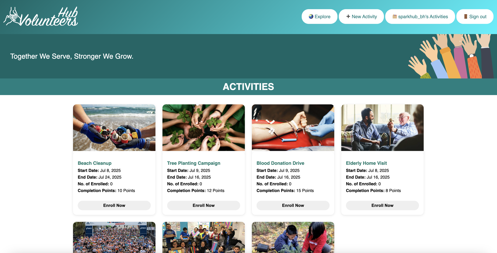

# 🙌 Volunteers Hub


A web-based volunteers platform designed to facilitate activity creation, volunteers enrollments, user's authentication, and leaderboard tracking. Built using Node.js, Express, MongoDB, and EJS, the system is aimed at fostering community engagement and recognizing top contributors.

## 🌟 Key Features
- 👥 User authentication (sign-up & sign-in)
- 📋 Activity creation, editing, and deletion
- 🧾 Volunteer enrollment & automatic point tracking
- 🏆 Leaderboard to highlight top volunteers
- 🧭 Dynamic breadcrumbs for improved navigation
- 🎨 Thematic design with animated visuals

## 📁 Folder Structure
```plaintext
.
├── controllers/
│   ├── activities.js           # Logic for activity routes
│   └── auth.js                 # Authentication routes
├── middleware/
│   ├── breadcrumbs.js          # Dynamic breadcrumb generation
│   ├── is-signed-in.js         # Access control middleware
│   └── pass-user-to-view.js    # User context for views
├── models/
│   ├── activity.js             # Mongoose schema for activities
│   └── user.js                 # Mongoose schema for users
├── public/
│   ├── images/                 # Static image assets
│   │   ├── hands.png
│   │   └── logo.png
│   ├── js/                     # Client-side JavaScript
│   │   ├── enroll.js
│   │   └── signup-validation.js
│   └── stylesheets/
│       └── style.css
├── views/
│   ├── activities/             # Activity views
│   │   ├── edit.ejs
│   │   ├── index.ejs
│   │   ├── new.ejs
│   │   └── show.ejs
│   ├── auth/                   # Auth views
│   │   ├── sign-in.ejs
│   │   └── sign-up.ejs
│   ├── messages/               # Post-action messages
│   │   └── message.ejs
│   ├── partials/               # Layout components
│   │   ├── _banner.ejs
│   │   ├── _breadcrumbs.ejs
│   │   ├── _footer.ejs
│   │   └── _navbar.ejs
│   └── index.ejs               # Home page
├── server.js                   # Main Express server
├── package.json
└── README.md
```

## 🧰 Technologies Used
- 🖥️ Node.js + Express – Server-side application
- 🗃️ MongoDB + Mongoose – Database
- 🎨 EJS – Templates for dynamic HTML rendering
🎯 CSS3 – Custom styling and layout
🛡️ express-session – Session-based authentication
🧩 Middleware – Routes control and breadcrumb logic

## 👨‍💼 User Roles
- Owner: Can create, edit, and manage volunteer activities.
- Volunteer: Can enroll in available activities and accumulate points.

## ⚙️ Functional Highlights
- Sign-Up Validation: Custom validation before account creation.
- Auto Sign-In: After successful registration, users are auto-logged in.
- Breadcrumb Generator: Provides navigation throughout the site.
- Popup Enrollment View: View enrolled users via popup modal.
- Leaderboard: Displays top volunteers based on activity participation.

## 🧠 Upcoming Enhancements
- 🔍 Activity filters (by date, category, etc.)
- 📨 Notifications for upcoming enrolled events
- 📊 Admin dashboard with analytics
- 📸 Profile pictures and other user details (name, scoial accounts) for volunteers
- 👨‍💼 Dynamic update of volunteers list per activity
- 📨 Alert for expired or wrong dates of activities
- Enhance the breadcrumb to efficiently show the Activity Name (Some screens shows the id)
- Show volunteers photo along with the user name in the activity details and in the Top Volunteers

## Logo Inspiration
The "Volunteers Hub" logo symbolizes the union of individual effort (hand) and community connection or hub (network), forming a collaborative spirit (joined hands). This unity is reflected in the elegant typography, capturing the heart of collective volunteer action.


## 📷 Screenshots


## 🎮 Demo
Volunteers hub can be accessed by visiting this [link](https://volunteers-hub.onrender.com)

## 👨‍💻 Developed By
Mohamed AlMehaiza – Full-stack Developer


## 📚 References

- [MDN – Express Middleware](https://developer.mozilla.org/en-US/docs/Learn/Server-side/Express_Nodejs/middleware)  
- [MDN – Templating engines (EJS)](https://developer.mozilla.org/en-US/docs/Learn/Server-side/Express_Nodejs/Introduction#templating)  
- [W3Schools – DOM Events](https://www.w3schools.com/js/js_htmldom_eventlistener.asp)  
- [Mongoose – Models and Schemas](https://mongoosejs.com/docs/models.html)  
- [MongoDB – Query Documents](https://www.mongodb.com/docs/manual/tutorial/query-documents/)  
- [MDN – Client-side Form Validation](https://developer.mozilla.org/en-US/docs/Learn/Forms/Form_validation)  
- [W3Schools – JavaScript Validation](https://www.w3schools.com/js/js_validation.asp)  
